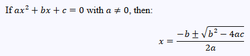

# jqmath-vanilla
Pure JavaScript version of jqMath math rendering library, so doesn't require jQuery. 
Forked from jqMath v0.4.6 (May-2016) which is copyright 2016, Mathscribe, Inc. and released under the MIT license.

jqMath makes it easy to put formatted mathematical expressions in web pages. 
Use a simple TeX-like syntax to write expressions directly into your HTML. e.g.,

If \$ax^2+bx+c=0\$ with \$a≠0\$, then: \$\$x={-b±√{b^2-4ac}}/{2a}\$\$

renders as:

<h2>Math rendering libraries</h2>

<table border='1'>
<thead><tr><th>Math Library</th><th>Release</th><th>HTTP requests</th><th>Transfer kB</th><th>First load</th><th>Cached load</th><th>Browser support</th></tr></thead>
<tbody>
<tr><td><b>jqMath vanilla</b></td><td><i>n/a</i> May-2020</td>
    <td>3</td><td>&nbsp;18.3</td><td>0.54s</td><td>0.47s</td><td>IE9+, Edge, FF?, Chrome ?, Safari ?, Opera ?</td></tr>
<tr><td><b><a href='https://mathscribe.com/author/jqmath.html' target='_blank' title='jqMath homepage'>jqMath+jQuery</a></b></td><td>v0.4.6 May-2016</td>
    <td>8</td><td>&nbsp;81.9</td><td>1.03s</td><td>0.90s</td><td>IE6+, FF2+, Chrome, Safari 3+, Opera 9+</td></tr>
<tr><td><b><a href='https://katex.org/' target='_blank' title='KaTeX homepage'>KaTeX</a></b>1</td><td>v0.11.1 Sep-2019</td>
    <td>14</td><td>215.7</td><td>1.67s</td><td>1.19s</td><td>IE9+, Edge, FF?, Chrome ?, Safari ?, Opera ?</td></tr>
<tr><td><b><a href='https://www.mathjax.org/' target='_blank' title='MathJax homepage'>MathJax+polyfill</a></b>2</td><td>v3.0.5 Mar-2020</td>
    <td>15</td><td>291.6</td><td>3.67s</td><td>2.66s</td><td>IE11+, Edge, FF38+, Chrome 29+, Safari 9+, Opera 33+, iOS 9+, Android 4+</td></tr>
</tbody>
</table>
The download transfer size &amp; load <i>time-until-idle</i> of each page in <code>/examples/</code> was performed with FF76 on a desktop PC. 
1KaTeX can alternatively be run server-side for compatibility with <u>all</u> browsers 
2MathJax v2.x supports older browsers including IE6-10
